# Backend Flows — temhorario-engine API

Todos os fluxos principais da API documentados com diagramas Mermaid. Use como referência para implementação e testes.

---

## 1. Booking Público (Cliente agenda pelo site)

Este é o fluxo mais importante da engine — é o que o usuário final experimenta.

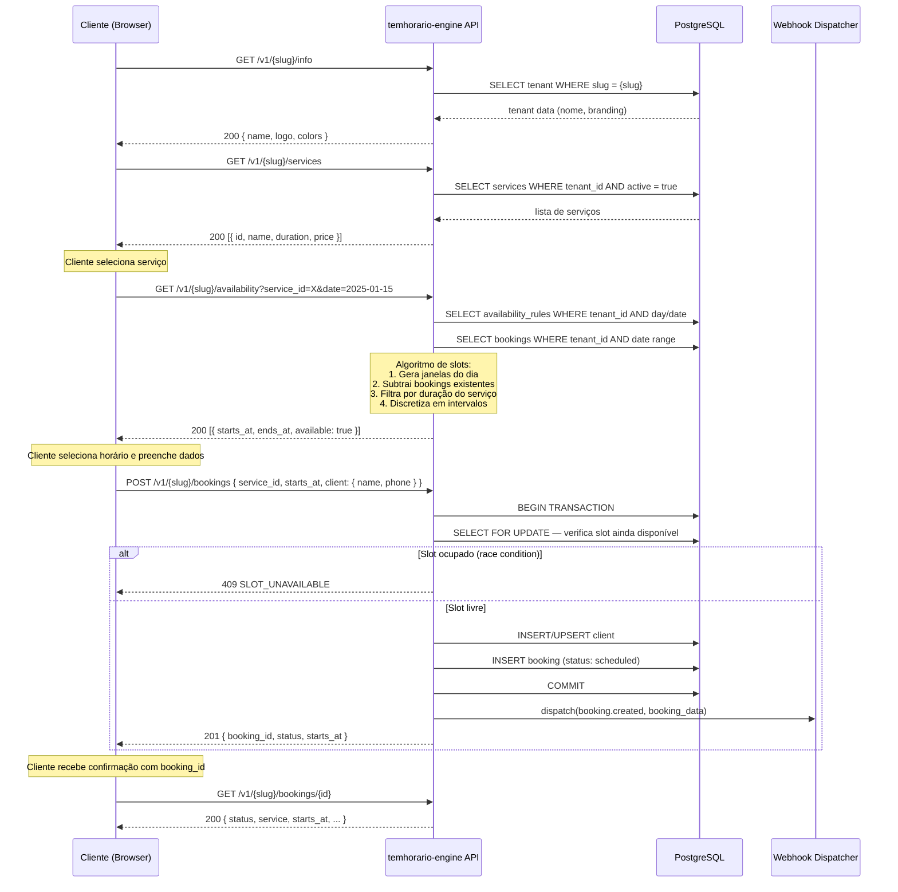

---

## 2. Ciclo de Vida do Booking (Admin)

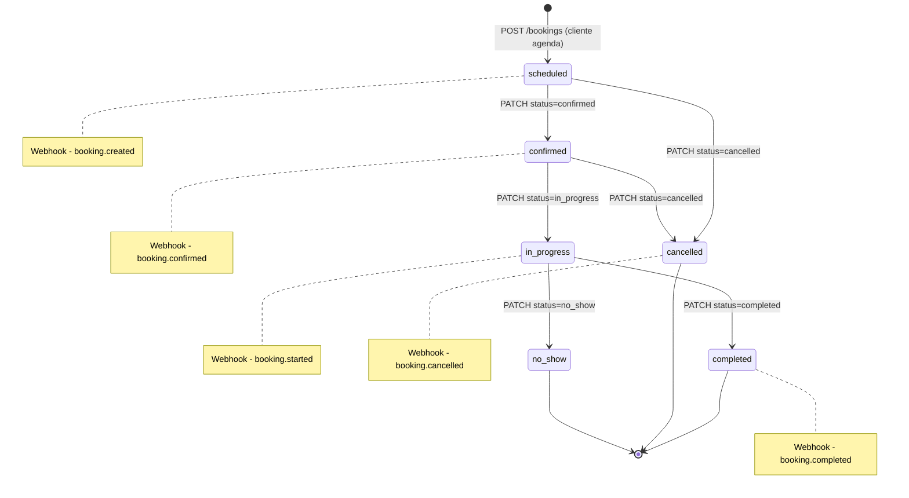

---

## 3. Atualização de Status (Admin Dashboard)

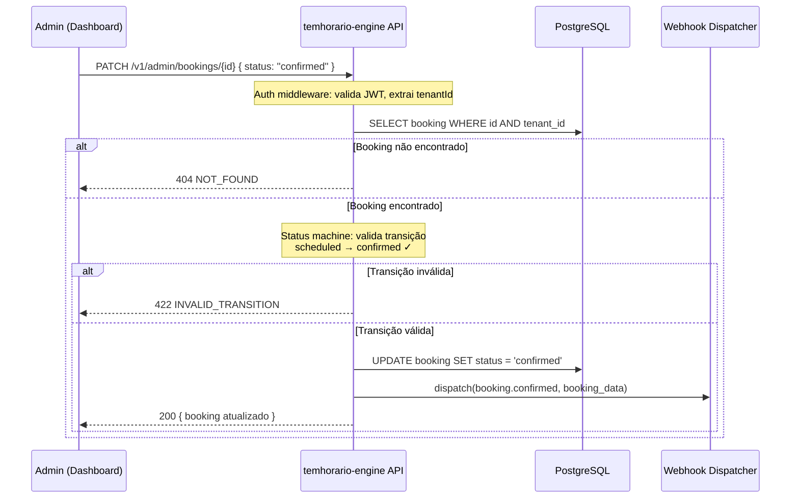

---

## 4. Autenticação Admin

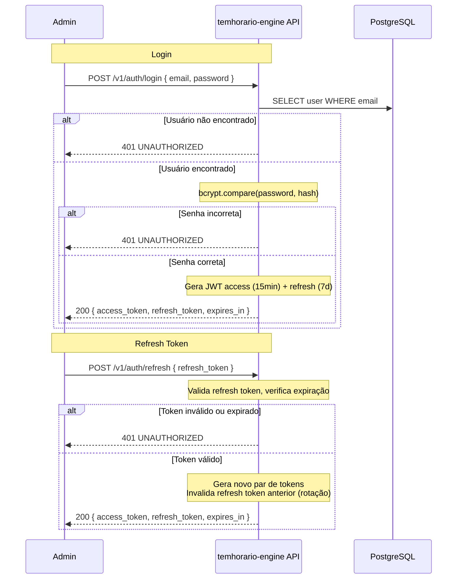

---

## 5. Gestão de Disponibilidade

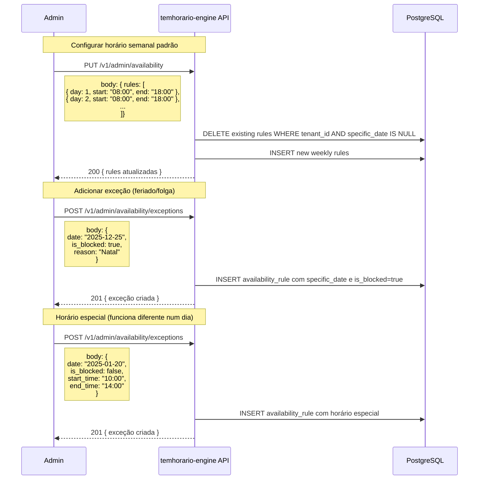

---

## 6. Algoritmo de Geração de Slots

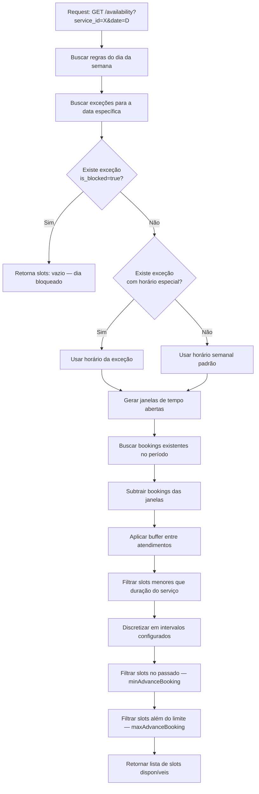

---

## 7. CRUD de Serviços

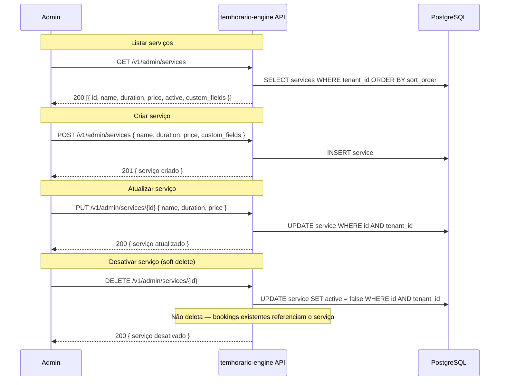

---

## 8. Webhook Dispatch

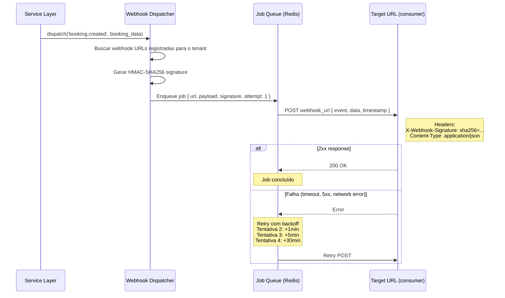

---

## 9. Onboarding de Tenant (Platform)

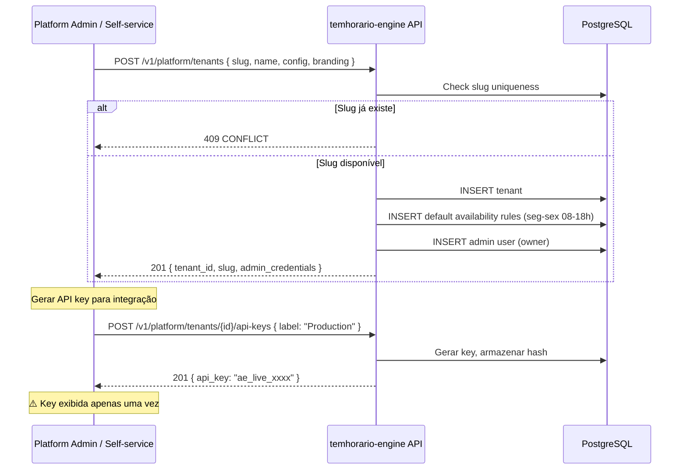

---

## 10. Relatórios

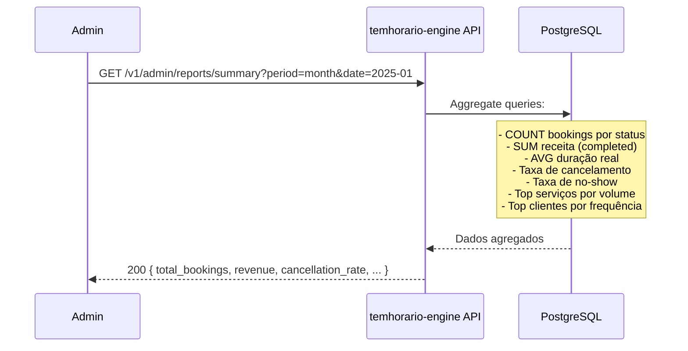

---

## 11. Request Pipeline Completo

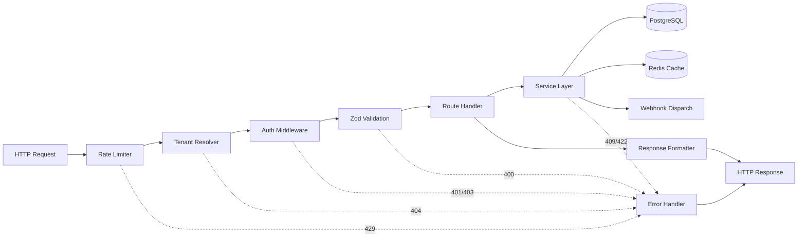
