# Frontend Flows — agenda-engine UI/UX

Todos os fluxos de interação do usuário documentados com diagramas Mermaid.

---

## 1. Booking Flow (Cliente Final)

O fluxo principal do produto — a experiência que o cliente final vive ao agendar um serviço.

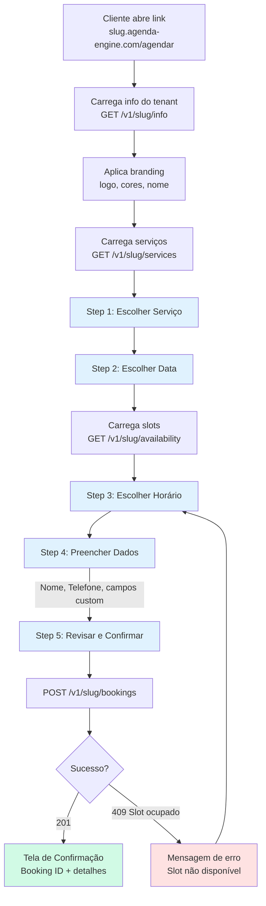

### Step Machine (estados do booking flow)

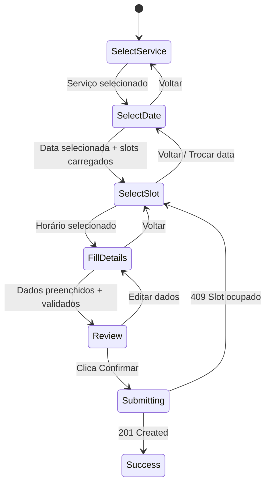

---

## 2. Booking Page — Componentes por Step

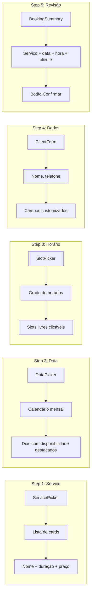

---

## 3. Admin — Login Flow

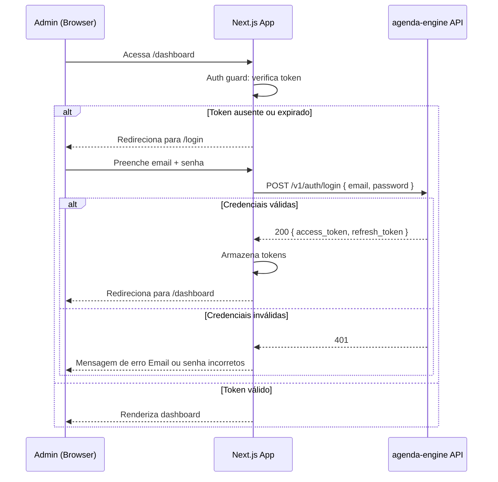

---

## 4. Admin — Dashboard (Visão do Dia)

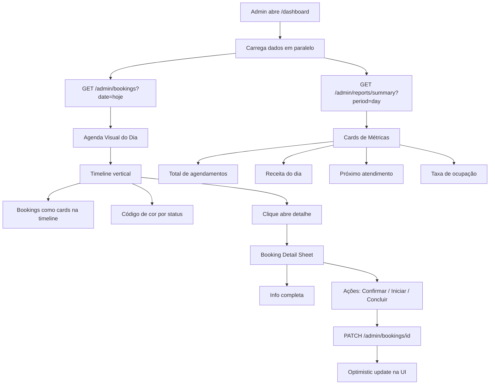

---

## 5. Admin — Agenda Visual (Semana)

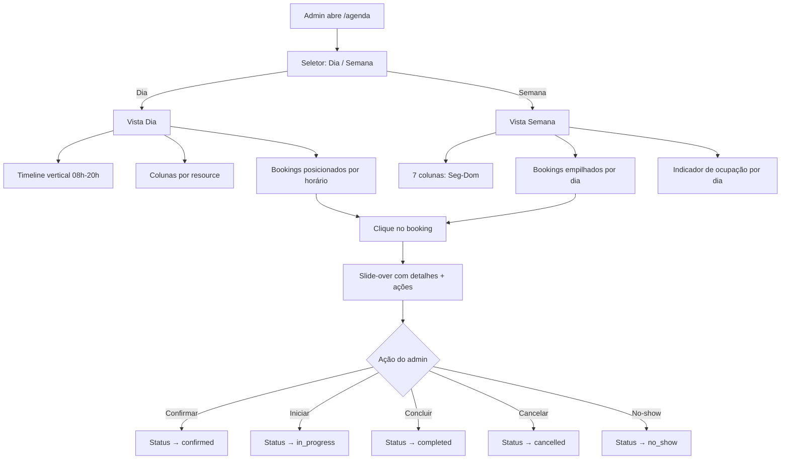

---

## 6. Admin — Gestão de Serviços

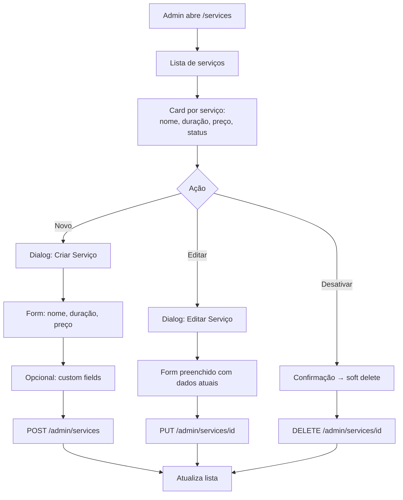

---

## 7. Admin — Configuração de Disponibilidade

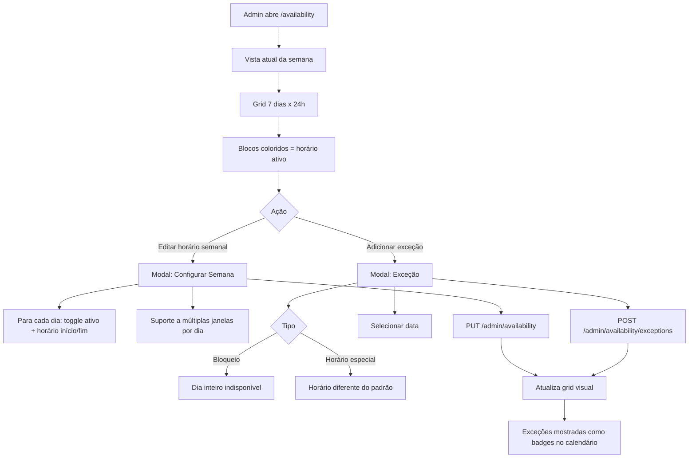

---

## 8. Admin — Lista de Bookings

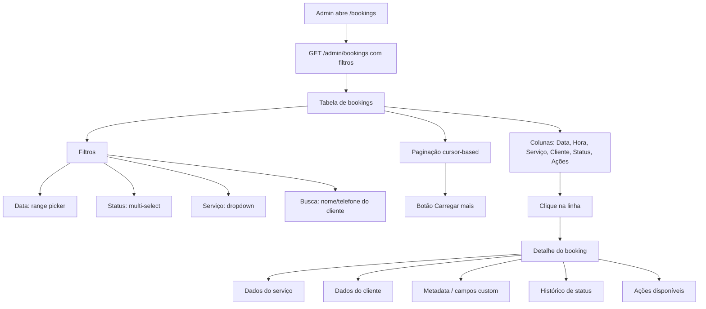

---

## 9. Admin — Clientes

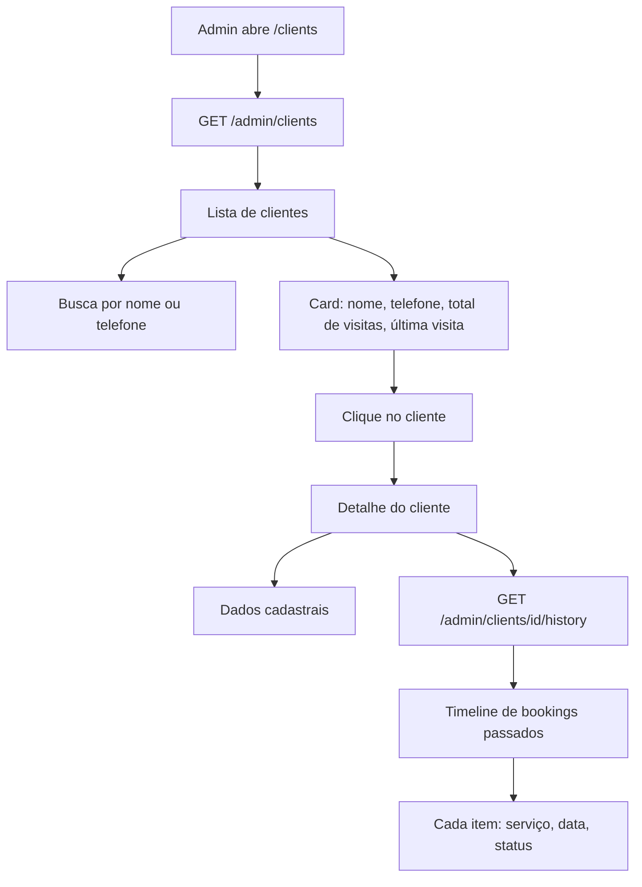

---

## 10. Consulta de Status (Cliente Final)

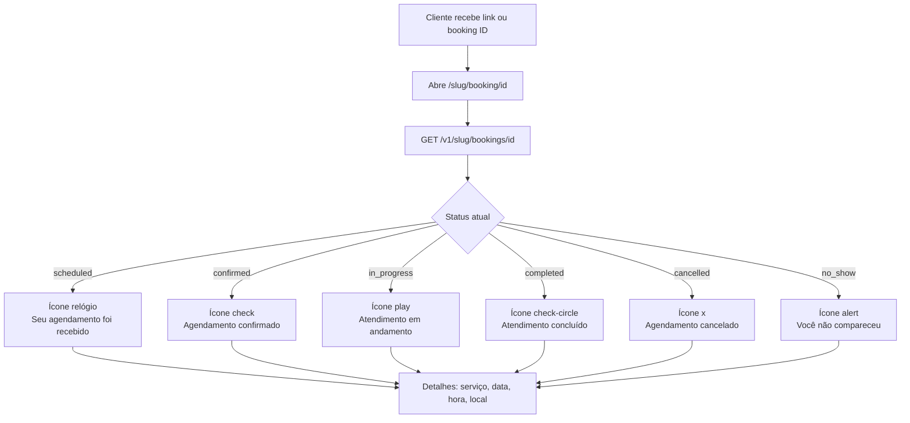

---

## 11. Navigation Map (Admin)

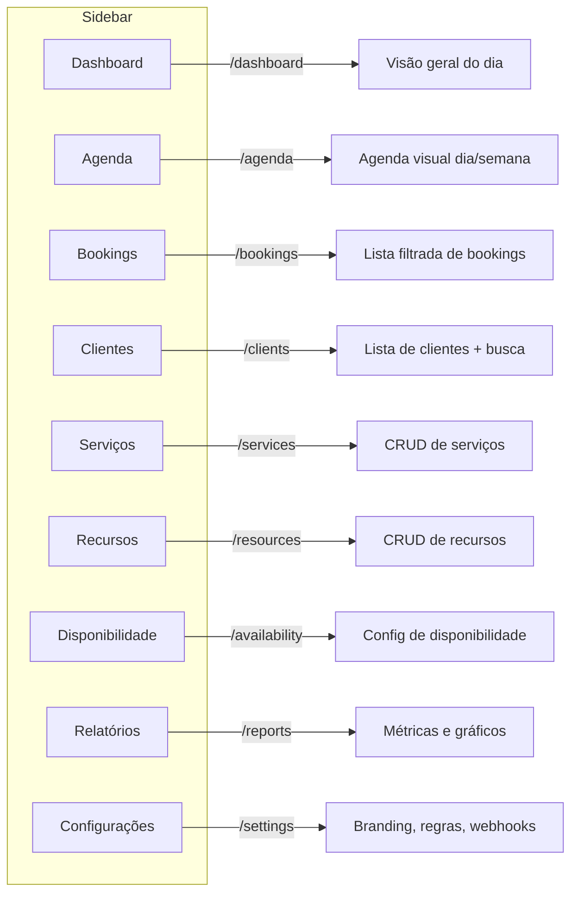

---

## 12. Estado Global e Data Flow

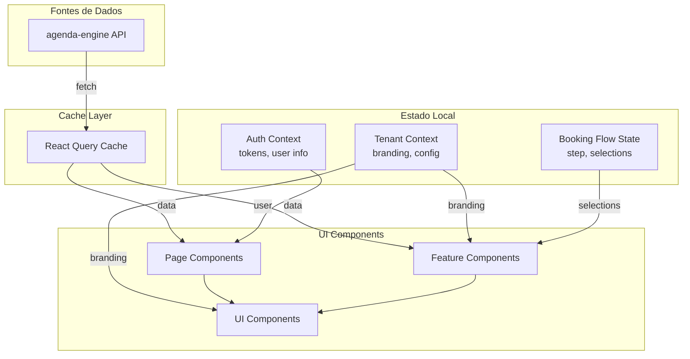
